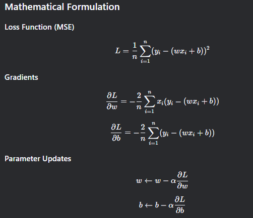

# Gradient Descent for Linear Regression (Pure Python Implementation)

  
*Visualization of gradient descent optimization*

## Description

This repository contains a pure Python implementation of batch gradient descent for linear regression, intentionally avoiding NumPy to demonstrate the fundamental mathematics. The implementation solves for parameters `w` (weight) and `b` (bias) in the linear equation `y = wx + b` by minimizing the Mean Squared Error (MSE) loss function.

## Features

- 🧠 **Pure Python+Numpy** - Numpy only
- 📉 **Batch Gradient Descent** - Processes all training samples each iteration
- 📊 **Loss Tracking** - Monitors MSE loss during training
- 🔍 **Transparent** - Clearly shows each mathematical operation
- 🎯 **Educational Focus & Pure Producti** - Designed for learning fundamentals

## Installation

Numpy and clone and run:

Windows:
```py
pip install numpy
```
Linux or Mac:
```py
pip3 install numpy
```

```bash
git clone https://github.com/epicbruh11111/Gradient-Descent_Ml.git
cd Gradient-Descent_Ml/src/
python GD.py
```
## Usage

### Basic Implementation

```py

from GD import gradient_descent   
from GD import  descent  # not recommended
# change the "..." with your vars.
x = ... 
y = ...
w = ...
b = ...
Learning_rate = ...

# Initialize the bias/w&b 
w,b = gradient_descent(x,y,w,b,Learning_rate)

"""
We have two functions:
descent and gradient_descent

we recommend using gradient_descent because it will give you the
answer immediately so you dont have to go through the pain of epoch

but we still give you the descent function if you want to build the rest from scratch. in nutshell use gradient_descent for fast implementation,
If you are a novice, or you just like it else use descent if you want
full control in the next step for better implementaion BUT before usign descent read the code to know how to implement the rest

"""
```
### Custom Training Loop

```py
# implement this or something like this if you want to use descent:
for epoch in range(400):
        #run gradient descent
        wf,bf = descent(x, y, w, b, learning_rate) # f = final
        yhat = wf*x + bf # predicted values
        loss = np.divide(np.sum((y-yhat)**2, axis=0), x.shape[0]) # calculate loss
        print(f"{epoch} loss is {loss}, parameters w: {wf}, b: {bf}")  # print loss and parameters

```
### Math Behind the sene



## API refrences

``` gradient_descent_step(x, y, w, b, learning_rate) ```
Preforms one gradient descent update.

* ```x:``` **List of input features**

* ```y:``` **List of target values**

* ```w:``` **Current weight value**

* ```b:``` **Current bias value**

* ```learning_rate:``` **Step size multiplier**

#### Returns:

``` Updated (w, b) tuple ```